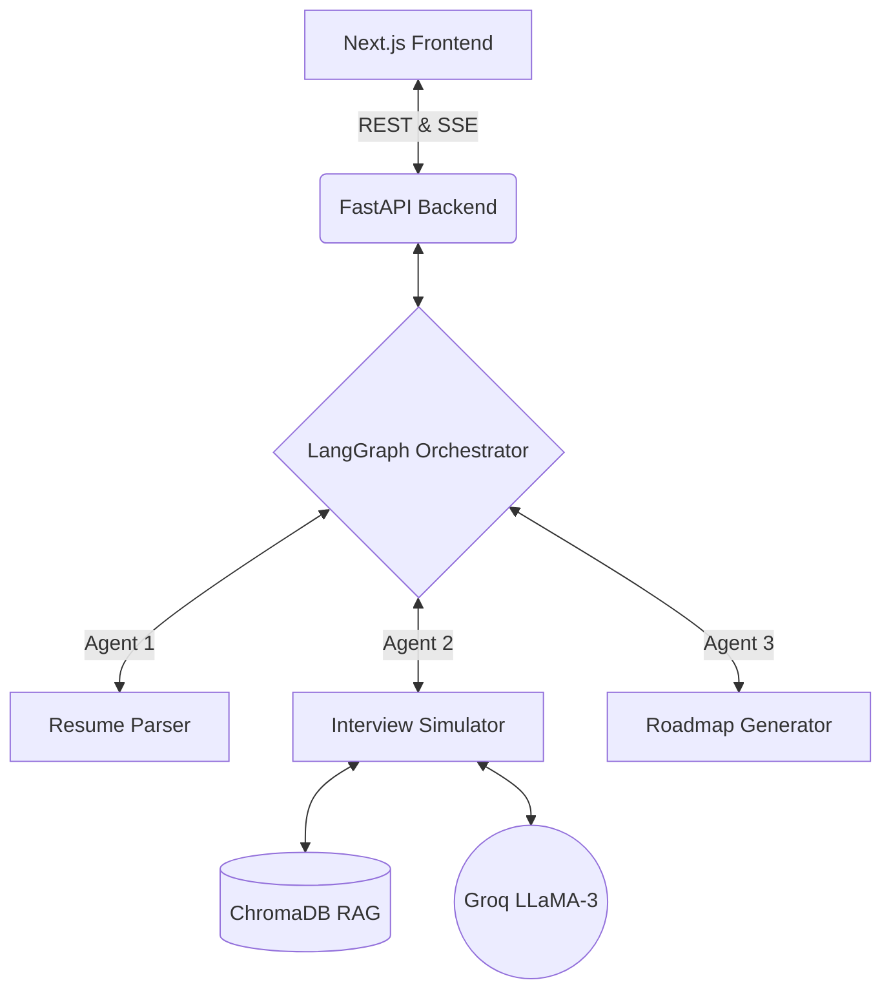

<div align="center">
  
  # PrepAgent AI
  
  **The ultimate AI-powered technical interview preparation platform.** <br/>
  Stop wandering through Leetcode. Start practicing with precision using LangGraph multi-agent systems and real-time RAG context.
  
  [](https://nextjs.org/)
  [](https://fastapi.tiangolo.com/)
  [](https://python.langchain.com/docs/langgraph)
  [](https://groq.com/)
  
</div>

---

## 🚀 Overview

**PrepAgent AI** is an advanced, autonomous multi-agent system designed to simulate grueling technical interviews at top-tier tech companies (Meta, Google, Netflix). By uploading your resume, the platform extracts your experience and generates a highly personalized, week-by-week study roadmap and subjects you to hyper-realistic mock interviews.

*(Replace with screenshot of Landing Page)*
``

## ✨ Core Features

1. **Hyper-Realistic Mock Interviews**: Uses a multi-agent LangGraph architecture to simulate a panel of interviewers. The AI doesn't just ask questions—it listens, asks follow-ups, and pushes you on system design trade-offs.
2. **Interactive Study Roadmaps**: Generates adaptive, day-by-day study plans customized to your target company and skill gaps.
3. **Real-time Analytics Dashboard**: Visually tracks your interview readiness score over time using interactive Recharts.
4. **Resume Parsing & Gap Analysis**: Extracts your experience and identifies weaknesses against top company rubrics using our advanced RAG pipeline.
5. **Live Streaming Chat**: Watch the AI reasoning and feedback via ultra-fast Server-Sent Events (powered by Groq).

*(Replace with screenshot of Dashboard)*
``

---

## 🧠 System Architecture

The architecture relies on a strict separation of concerns, leveraging Next.js for a premium Apple/Vercel-style minimalist frontend and FastAPI for high-performance Python AI operations.

- **Frontend**: Next.js 14 (App Router), Tailwind CSS, Framer Motion (for cinematic scroll animations), Recharts (for analytics).
- **Backend**: FastAPI, LangChain, LangGraph (for stateful agent workflows), SQLite (for persistence).
- **AI/LLM**: Groq API (LLaMA-3.3-70b-versatile) for lightning-fast inference.



---

## 🛠️ Local Development Setup

To run PrepAgent AI locally, you will need a [Groq API Key](https://console.groq.com/keys).

### 1. Environment Variables
Clone the repository and set up your environment variables:
```bash
git clone https://github.com/yourusername/prepagent-ai.git
cd prepagent-ai
cp .env.example .env
```
Add your Groq API key to the `.env` file.

### 2. Run with Docker (Recommended)
The easiest way to spin up both the frontend and backend is using Docker Compose:
```bash
docker-compose up --build
```
- **Marketing Site & App**: `http://localhost:3000`
- **Backend API Docs**: `http://localhost:8000/docs`

### 3. Manual Startup

**Frontend (Next.js):**
```bash
cd frontend
npm install
npm run dev
```

**Backend (FastAPI):**
```bash
cd backend
python -m venv venv
source venv/bin/activate  # On Windows: venv\Scripts\activate
pip install -r requirements.txt
uvicorn app.main:app --reload --port 8000
```

---

## 📈 Future Roadmap
- [ ] Voice-to-Text integration for verbal mock interviews.
- [ ] Interactive Kanban board for study roadmaps.
- [ ] WebRTC peer-to-peer mock interviews.

## 📄 License
This project is licensed under the MIT License.
